<p align="center">
  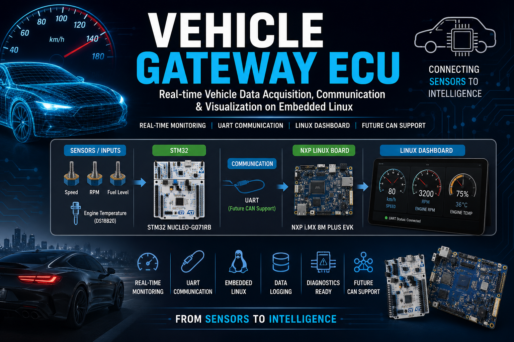
</p>

# Vehicle Gateway ECU

<p align="center">
  
</p>

<p align="center">


</p>
An Automotive Vehicle Gateway ECU developed using the **STM32 NUCLEO-G071RB** and **NXP i.MX 8M Plus EVK** for real-time vehicle data acquisition, UART communication, Embedded Linux processing, diagnostics, and dashboard visualization.

---

# Overview

Modern vehicles consist of multiple Electronic Control Units (ECUs) that exchange information continuously. A Vehicle Gateway ECU acts as a communication bridge between these ECUs while collecting, processing, and forwarding vehicle information.

This project demonstrates a simplified Vehicle Gateway ECU capable of:

- Reading vehicle parameters from STM32
- Processing data on Embedded Linux
- Transmitting data over UART
- Displaying real-time dashboard information
- Logging vehicle information
- Preparing the system for future CAN integration

---

# Features

- Real-time Vehicle Monitoring
- STM32 Data Acquisition
- Embedded Linux Application
- UART Communication
- Vehicle Parameter Dashboard
- Data Logging
- Diagnostic Monitoring
- Modular Firmware Architecture
- Professional Documentation

---

# Vehicle Parameters

| Parameter | Range |
|-----------|---------|
| Vehicle Speed | 0–180 km/h |
| Engine RPM | 800–7000 RPM |
| Fuel Level | 0–100 % |
| Engine Temperature | -20°C to 150°C |

---

# Hardware Used

| Hardware | Description |
|-----------|-------------|
| STM32 NUCLEO-G071RB | Data Acquisition Controller |
| NXP i.MX 8M Plus EVK | Embedded Linux Processing |
| Potentiometer ×3 | Speed, RPM, Fuel Simulation |
| DS18B20 | Temperature Sensor |
| USB UART | Communication Interface |

---

# Software Stack

- Embedded C
- Embedded Linux
- STM32CubeIDE
- STM32CubeMX
- MCUXpresso IDE
- GCC
- Git
- GitHub
---

# System Architecture

<p align="center">
  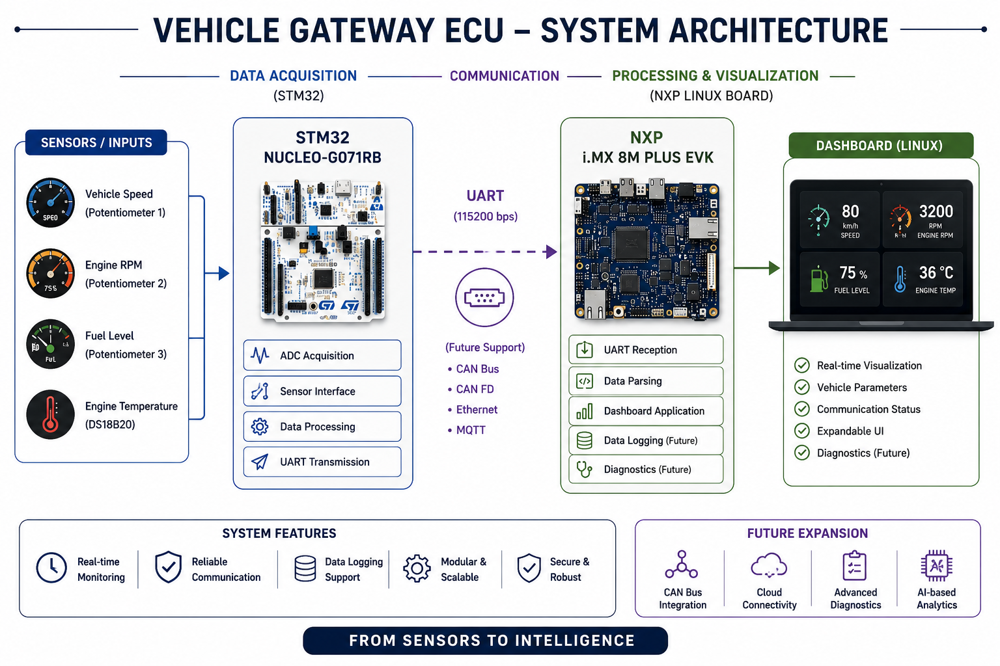
</p>

The Vehicle Gateway ECU consists of two major processing units:

- STM32 NUCLEO-G071RB
- NXP i.MX 8M Plus EVK

The STM32 acquires sensor data and transmits it over UART, while the Embedded Linux application running on the NXP board processes, logs, and displays the information.

---

# Block Diagram

<p align="center">
  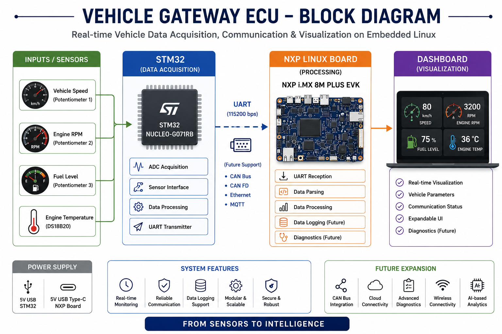
</p>

---

# Data Flow

<p align="center">
  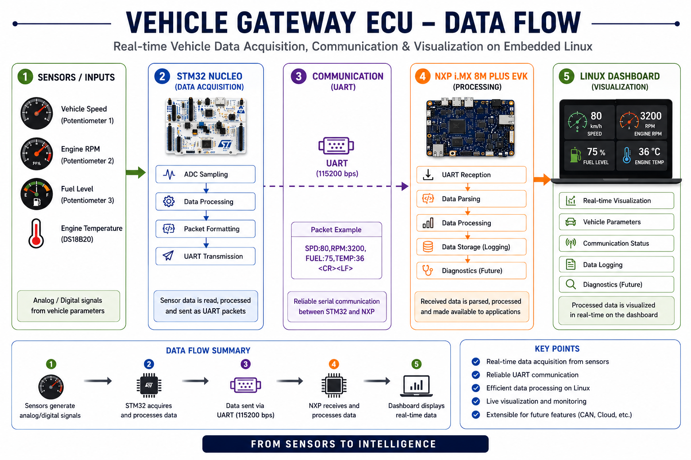
</p>

The data flow follows these steps:

1. Sensor Acquisition
2. ADC Processing
3. STM32 Data Formatting
4. UART Packet Transmission
5. Embedded Linux Parsing
6. Dashboard Update
7. Data Logging

---

# Software Stack

<p align="center">
  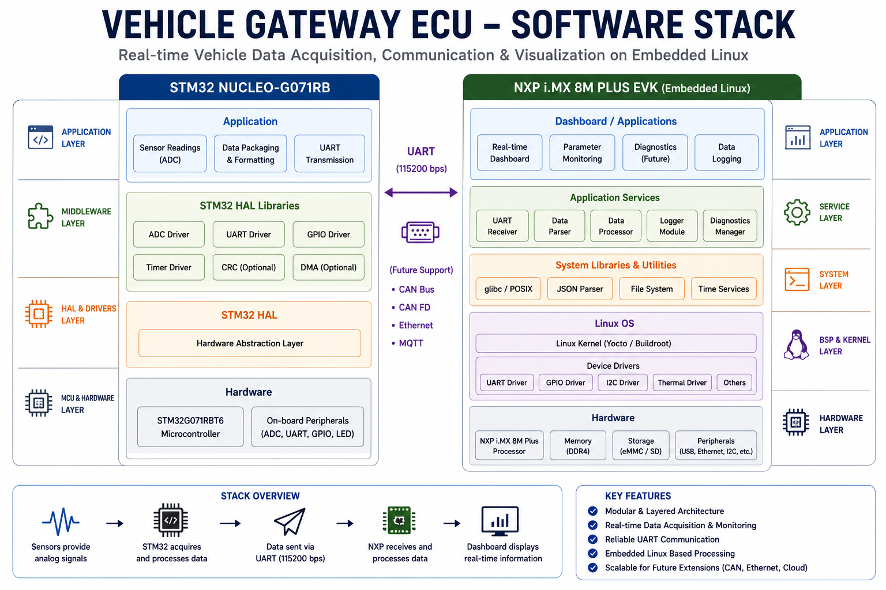
</p>

The project software is divided into multiple layers.

| Layer | Description |
|--------|-------------|
| Hardware | Sensors and STM32 |
| HAL Drivers | STM32 HAL Libraries |
| Firmware | Embedded C Application |
| UART | Communication Layer |
| Embedded Linux | NXP Processing |
| Dashboard | Vehicle Monitoring |
| Logger | Data Storage |

---

# Hardware Setup

<p align="center">
  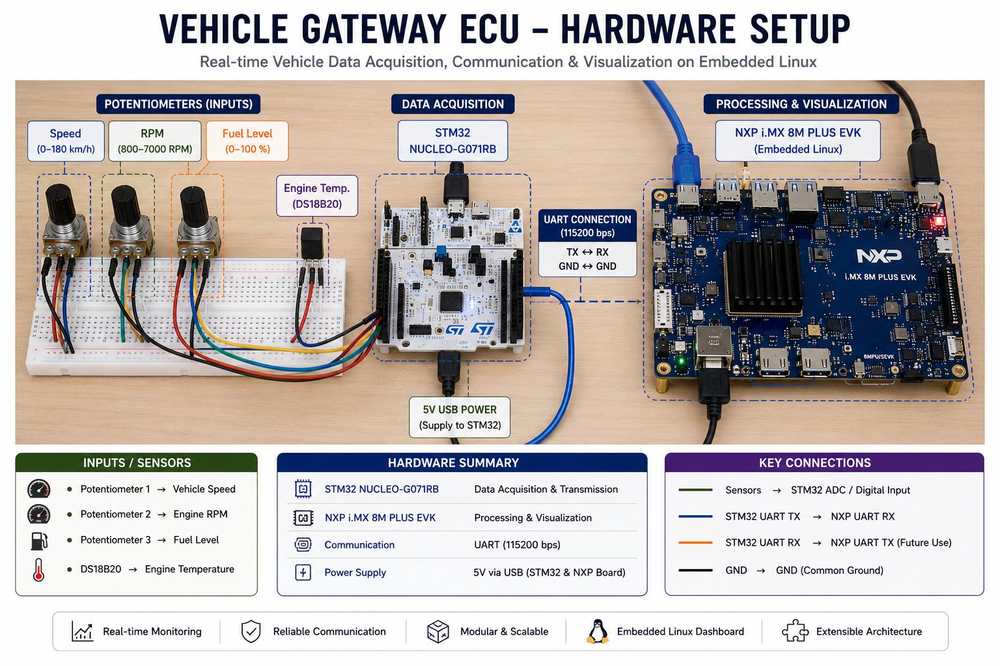
</p>

The hardware setup consists of:

- STM32 NUCLEO-G071RB
- NXP i.MX 8M Plus EVK
- 3 Potentiometers
- DS18B20 Temperature Sensor
- UART Communication

---

# Wiring Diagram

<p align="center">
  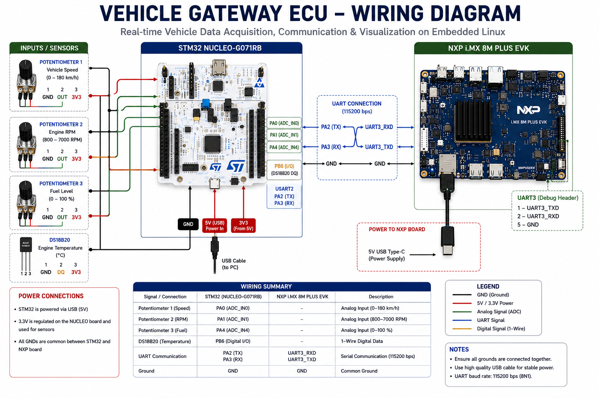
</p>

---

# Board Connections

<p align="center">
  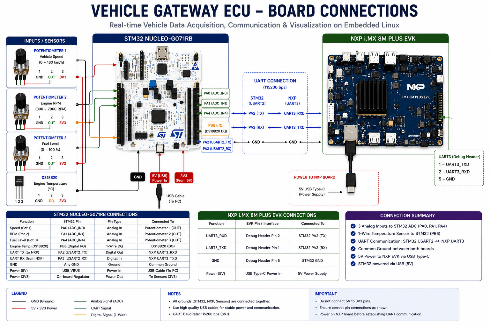
</p>
---

# Dashboard

## Embedded Linux Dashboard

<p align="center">
  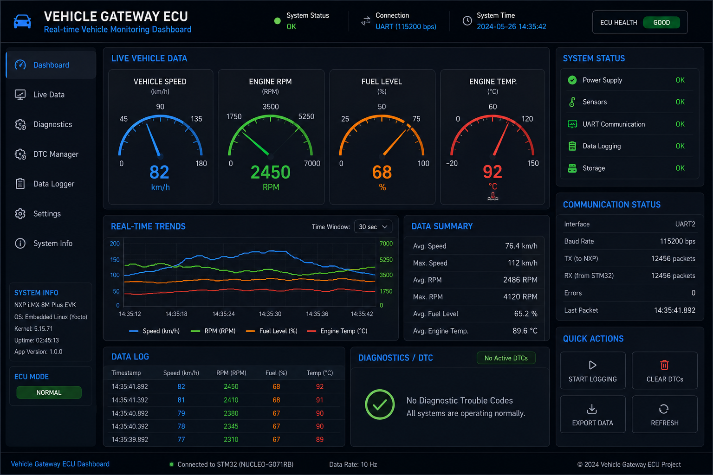
</p>

The dashboard provides real-time visualization of vehicle information received from the STM32 microcontroller.

Displayed information includes:

- Vehicle Speed
- Engine RPM
- Fuel Level
- Engine Temperature
- UART Communication Status
- System Health

---

## Terminal Dashboard

<p align="center">
  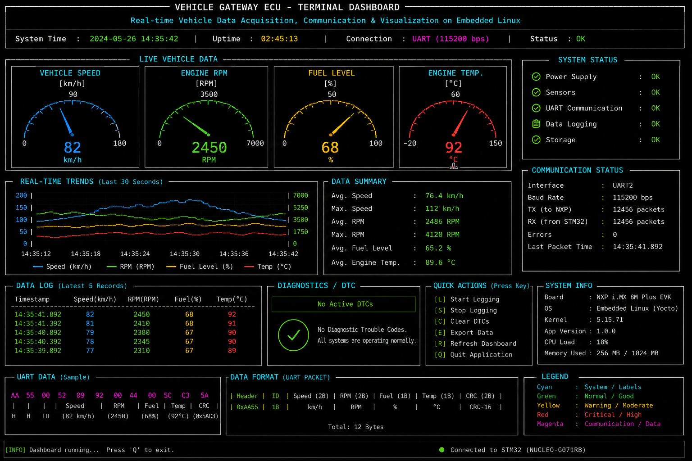
</p>

The terminal dashboard provides a lightweight Embedded Linux interface for monitoring vehicle parameters and communication status in real time.

---

## Vehicle Parameters

<p align="center">
  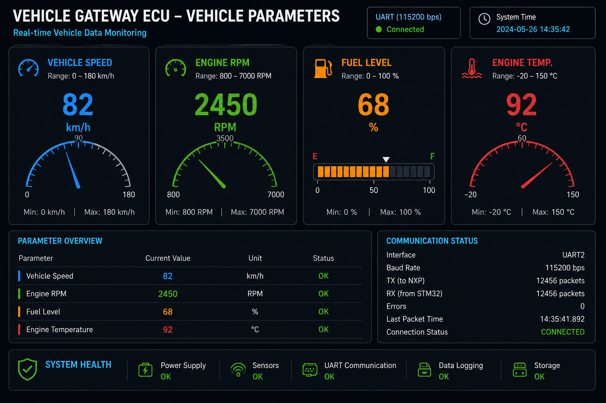
</p>

The parameter view displays the latest values received from the STM32 firmware in an easy-to-read format.

---

# Runtime Results

## UART Output

<p align="center">
  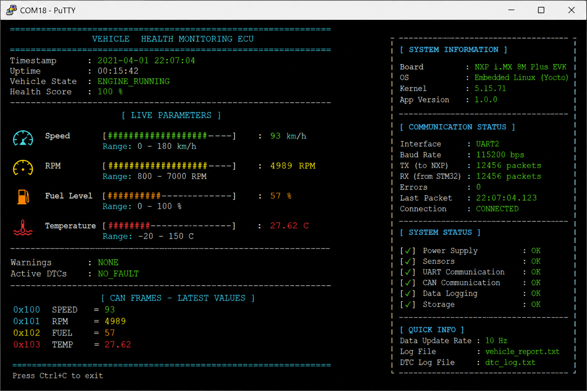
</p>

Live UART packets transmitted from the STM32 to the NXP Embedded Linux board.

---

## System Running

<p align="center">
  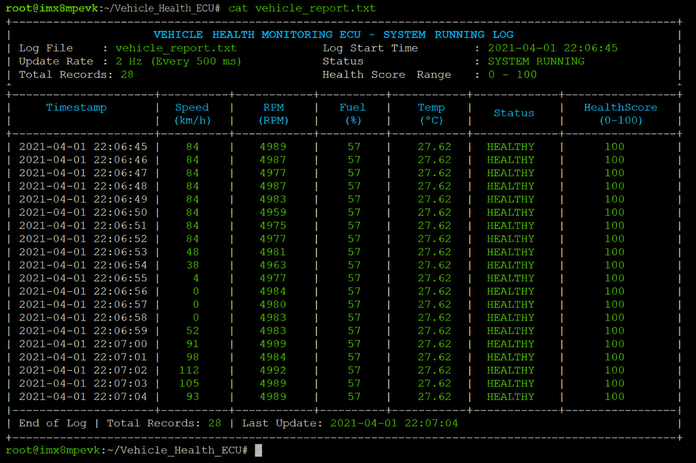
</p>

The Embedded Linux application continuously processes incoming UART data and updates the system status.

---

## Communication Flow

<p align="center">
  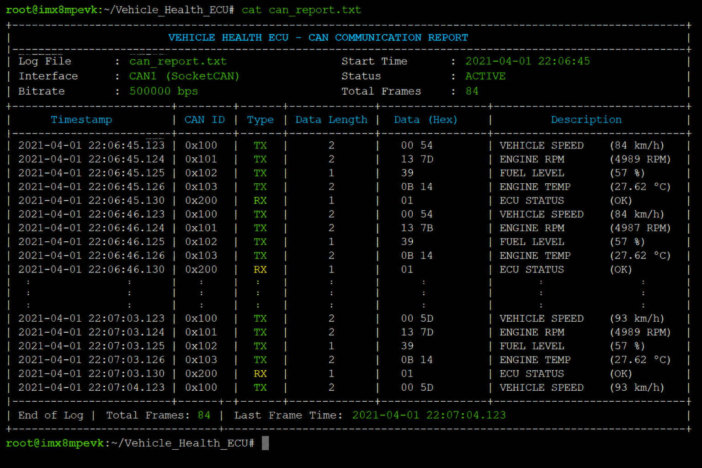
</p>

Demonstration of communication logs between the STM32 firmware and the Embedded Linux application.

---

## Logging Demo

<p align="center">
  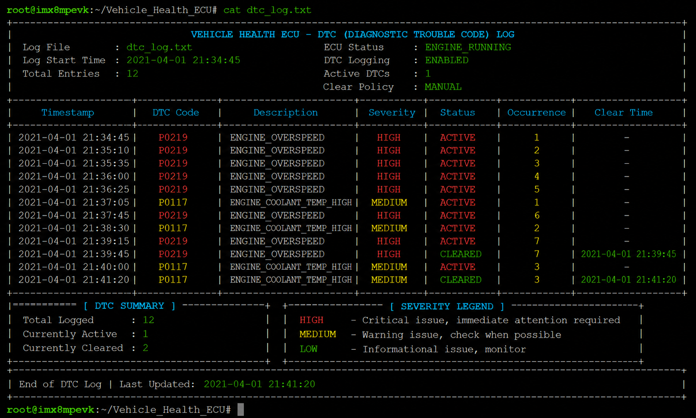
</p>

Example of diagnostic logging and vehicle monitoring data generated by the application.
---

# Project Structure

```text
Vehicle-Gateway-ECU
│
├── .github/
├── dashboard/
├── docs/
├── firmware/
│   ├── Core/
│   ├── Drivers/
│   ├── Inc/
│   ├── Src/
│   └── stm32cubemx/
├── hardware/
├── images/
│   ├── architecture/
│   ├── dashboard/
│   ├── hardware/
│   └── results/
├── linux/
├── scripts/
├── simulations/
├── .gitignore
├── CITATION.cff
├── LICENSE
└── README.md
```

---

# Installation

Clone the repository:

```bash
git clone https://github.com/shashikiranam/Vehicle-Gateway-ECU.git
```

Navigate to the project directory:

```bash
cd Vehicle-Gateway-ECU
```

---

# Project Workflow

```text
Vehicle Sensors
        │
        ▼
STM32 NUCLEO-G071RB
        │
        ▼
ADC Processing
        │
        ▼
UART Communication
        │
        ▼
NXP i.MX 8M Plus EVK
        │
        ▼
Embedded Linux Application
        │
        ▼
Dashboard + Data Logger
        │
        ▼
Diagnostics
```

---

# Future Improvements

- CAN Bus Integration
- CAN FD Support
- OBD-II Diagnostics
- DTC Management
- SQLite Database Logging
- MQTT Cloud Connectivity
- Ethernet Communication
- OTA Firmware Updates
- PyQt GUI Dashboard
- Touchscreen Support
- AI-Based Fault Detection
- AUTOSAR-Compatible Architecture

---

# Author

**Shashi Kiran A M**

Embedded Systems Engineer

Automotive Electronics Engineer

Machine Learning Engineer

GitHub: <https://github.com/shashikiranam>

---

# License

This project is released under the MIT License.

---

## Acknowledgements

This project was developed as part of an embedded systems learning and portfolio initiative focused on automotive gateway ECU architecture, Embedded Linux, STM32 firmware development, and real-time vehicle communication.
